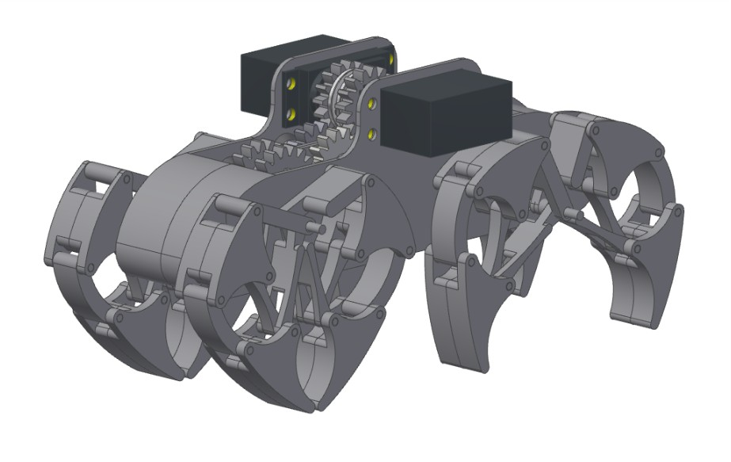
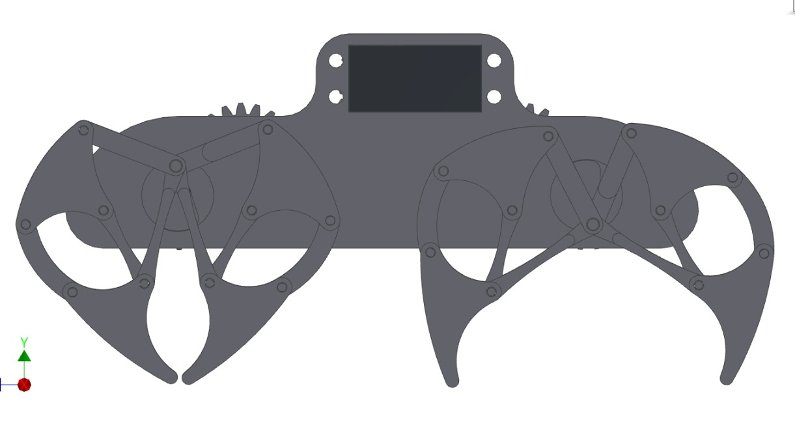
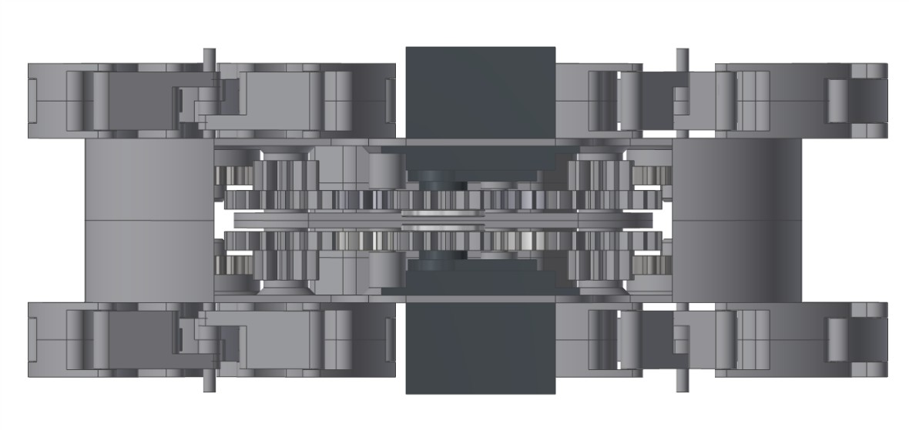
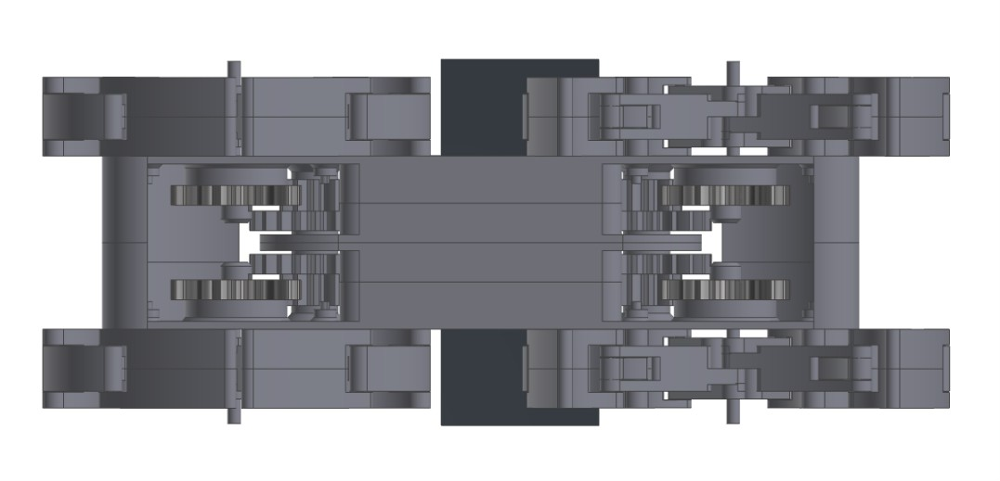

Title: AG1_仿生自走獸
Date: 2017-06-21 12:08
Category:行走機構
Tags: 行走機構
Author: 40423137

1.期末分組專題

2.分配工作

(a)V-rep模擬

(b)Onshape協同繪圖

<!-- PELICAN_END_SUMMARY -->

以下是學號建立帳號 Youtube 與 Vimeo。

Youtube影片連結：
<a href="https://www.youtube.com/channel/UCAakI7RrExU7gAyhMF3FUEg">陳慶豪</a>

Vimeo影片連結：
<a href="https://vimeo.com/user45109608">40423137</a>

#AG1_仿生自走獸

##1.期末分組專題連結：
<a href="https://40423105.github.io/2017springcd_hw/blog/qi-mo-fen-zu-zhuan-ti-ag1_fang-sheng-zi-zou-shou.html">AG1_仿生自走獸</a>

<!-- PELICAN_END_SUMMARY -->
##2.分配工作
 我是主要做建構的部分，經過討論我們選用3D列印來當主體材料，連桿部分找的是仿生獸的連桿機構，連桿尺寸是參考當時原作者的設計去做比例縮放，縮放成這樣的大小，內部齒輪傳動有使用傳動比去做動力放大，主體分成2半，使用2顆伺服馬達去做動力來源，所以此機構能夠做左右轉向的行動，外型的設計純粹是自己設計的，並無參考網路資料，如果有雷同處，我也只能說我跟他有著相同的想法而已
 
<h2>正齒輪1~3繪製影片</h2>
<iframe width="560" height="315" src="https://www.youtube.com/embed/PhBmiS6bcko" frameborder="0" allowfullscreen></iframe>
 
 <h2>TEST影片</h2>
<iframe width="560" height="315" src="https://www.youtube.com/embed/V53qrXlRgLM" frameborder="0" allowfullscreen></iframe>
 
<h2>等角視圖</h2>

<h2>前視圖</h2>

<h2>上視圖</h2>

<h2>右視圖</h2>

<h2>下視圖</h2>

<h2>模擬影片</h2>

<iframe width="560" height="315" src="https://www.youtube.com/embed/12Tex9wk5eQ" frameborder="0" allowfullscreen></iframe>

